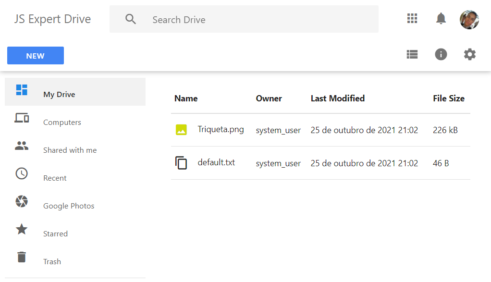

<div align="center">
  <div>
    <h1>Google Drive Clone</h1>
    
    <h3>
      🗂️ Uma aplicação JavaScript Vanilla que se propõe a clonar, além da interface, a funcionalidade de upload de arquivos on demand do Google Drive.
    </h3>
  </div>

  <p>
    <a href="#-status">Status</a> •
    <a href="#-features">Features</a> •
    <a href="#%EF%B8%8F-pré-requisitos">Pré-requisitos</a> •
    <a href="#-tecnologias-utilizadas">Tecnologias utilizadas</a> •
    <a href="#-autor">Autor</a> •
    <a href="#-readme-versions">README versions</a>
  </p>

  <div>
    
    
    
  </div>
</div>

<hr>

### 🏁 Status

<h3 align="center">
  🎉 Google Drive Clone ✔️ Finalizado 🎉
</h3>

<hr>

### 🏆 Features

#### Geral

- [x] Listar arquivos baixados.

#### Frontend

- [x] Permitir upload de arquivos de qualquer tamanho;
- [x] Possuir função de upload via botão;
- [x] Possuir função de upload via drag and drop; e
- [x] Exibir progresso de upload.

#### Backend

- [x] Receber stream de arquivos e salvar em disco;
- [x] Notificar o Client sobre o progresso de armazenamento de arquivos em disco;
- [x] Permitir upload de arquivos em formato de imagem, vídeo e áudio; e
- [x] Atingir 100% de cobertura de código em testes.

<hr>

### ❗️ Pré-requisitos

Fala Dev, beleza? Antes de iniciar seus testes e/ou contribuições na aplicação, é necessário ter duas coisas instaladas, a primeira é o nosso maravilhoso [GIT](https://git-scm.com) e a segunda, o [Node.js](https://nodejs.org/en/), além, é claro, de um bom editor de texto.

Bom, com tudo instalado e pronto, podemos ir para o passo a passo de como rodar a aplicação.

### 🕹️ Rodando a aplicação

```bash
# Primeiramente, clone este repositório com o GIT
$ git clone <https://github.com/ThiagoBrito-Dev/google-drive-clone>

# Acesse a pasta do projeto pelo terminal de comando
$ cd .../google-drive-clone/app

# Instale as dependências presentes no package.json
$ yarn / npm install

# Execute a aplicação
$ yarn start

# E, por fim, acesse <http://127.0.0.1:8080> para ver a aplicação rodando no servidor local
```

<hr>

### 🔮 Tecnologias utilizadas

- [HTML](https://devdocs.io/html/)
- [CSS](https://devdocs.io/css/)
- [JavaScript](https://devdocs.io/javaScript/)
- [Node.js](https://nodejs.org/en/)
- [Jest](https://jestjs.io/pt-BR/)
- [Busboy](https://www.npmjs.com/package/busboy)
- [Form-Data](https://www.npmjs.com/package/form-data)
- [Socket.IO](https://socket.io/)
- [Pino](https://www.npmjs.com/package/pino)
- [Pino-pretty](https://www.npmjs.com/package/pino-pretty)
- [Pretty-bytes](https://www.npmjs.com/package/pretty-bytes)

<hr>

### 👨🏽‍🎓 Autor

<div align="center">
  

  <br />

  <div>
    <h3>
      🤝 Thiago Raniery Brito
    </h3>
    <p>E aí Dev, gostou da aplicação? Bom, se quiser, fique à vontade para entrar em contato comigo por aqui ou pelas tags abaixo.</p>
  </div>
  
  <div>
    <a href="https://www.linkedin.com/in/thiagoranierybrito/">
      
    </a>
    <a href="mailto:thiagobritotrs@gmail.com">
      
    </a>
  </div>
</div>

<hr>

### 📚 README versions

<div>
  <a href="https://github.com/ThiagoBrito-Dev/google-drive-clone/blob/main/README.md">Portuguese (pt-br)</a>
  |   
  <a href="https://github.com/ThiagoBrito-Dev/google-drive-clone/blob/main/README-en.md">English (en-us)</a>
</div>
